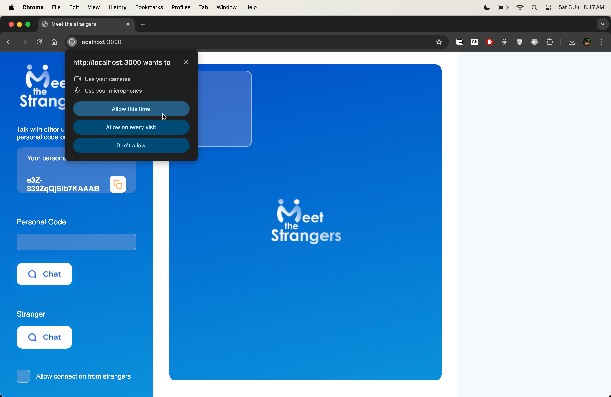

# WebRTC Meet the Strangers
 Omegle clone with direct calls possibility with vanilla JavaScript

## Description
This project is a clone of the famous Omegle website. It allows you to chat with strangers and also to make direct calls with them. The project is built with vanilla JavaScript and WebRTC.

## Features
- Chat with strangers
- Make direct calls with strangers
- Mute audio
- Mute video
- End call
- Copy link to share with friends

## How to use
1. Open the website
2. Click on the "New chat" button
3. Copy the link and share it with your friends
4. Wait for someone to join the chat
5. Start chatting or make a direct call

## How to run
1. Clone the repository
2. Open the project folder
3. Run `npm install`
4. Run `npm start`

## Technologies
- HTML
- CSS
- JavaScript
- WebRTC
- Express

## Demo
[Click here to see the demo](https://meet.shade.cool/)

## License
[MIT](https://choosealicense.com/licenses/mit/)

